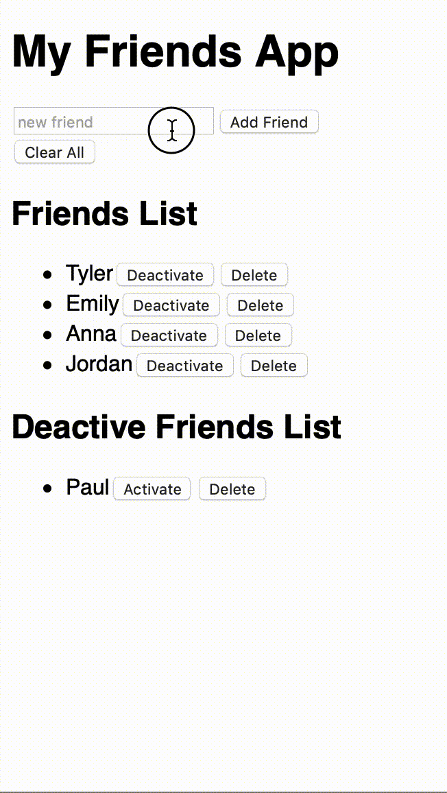

# React Friends App
The purpose of this app was to introduce me to React and start to understand the fundamentals of the framework using state and props. Since the purpose was to understand the power of React, I did not add CSS to this project.

### How to use it... 
Pretty simple, think 6th grade. Who are my current friends? Add them to you list of friend but if they cross you, you can put them on your 'not friends' list by deactivating them. You can also delete each individual person or your entire list. 

:thumbsup: *Thanks for checking out my work on GitHub! For more about me find me on Twitter @TyeDev or vist my personal website at www.TyeCampbell.com.*

